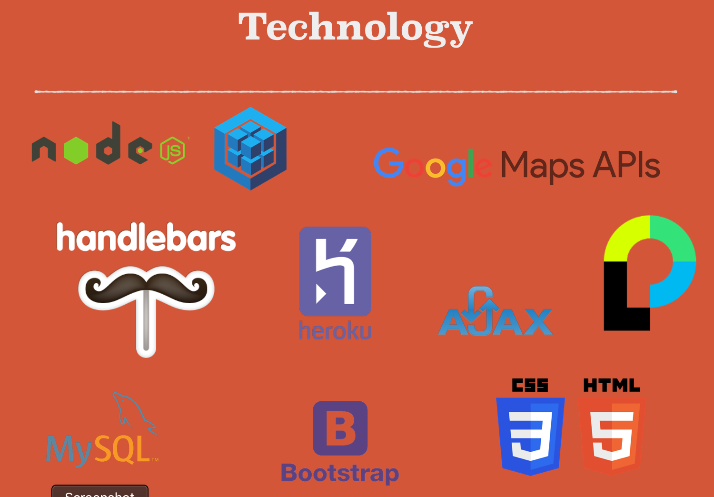

# Nashville Hot Chicken Adventure

Nashville Hot Chicken Adventure is an interactive web application allowing users to eat their way through Nashville’s best hot chicken establishments. Users can create an account to track and map their progress in conquering the hottest of chickens.  


;

## Installation

If you are cloning/downloading the GitHub repo, please be sure to use the package manager [NPM](https://www.npmjs.com/) to install the needed packages for the project to run through node and express:

```bash
NPM dependencies:
    "bcrypt-nodejs": "0.0.3",
    "body-parser": "^1.19.0",
    "dotenv": "^6.0.0",
    "express": "^4.16.4",
    "express-handlebars": "^3.0.0",
    "express-session": "^1.16.1",
    "mysql": "^2.17.1",
    "mysql2": "^1.6.5",
    "nodemon": "^1.19.0",
    "passport": "^0.4.0",
    "passport-local": "^1.0.0",
    "sequelize": "^4.44.0"
```
This can be done by running the below code for each dependency

```bash
npm install [program]
```

or you can simply run the below:

```bash
npm i
```

## How to run the program

The application is hosted through heroku and is available at the below link.

```bash
https://mysterious-scrubland-71212.herokuapp.com/
```

## Project Technical Specs
Nashville Hot Chicken Adventure is an express and node served application that is hosted on heroku with a jawsdb database.  The application utilizes passport js and bcrypt to authenticate users.  Additionally, Sequelize models are used to access the jawsdb (mysql locally).

;

## Contributors
Denise Martin: Lead Front-End Designer
Brian Storey:  Google Map API developer
John Westbrooks:  Authentication, routing, database schema developer
Rob Suttles:  Database seeding, routing, and front-end developer
